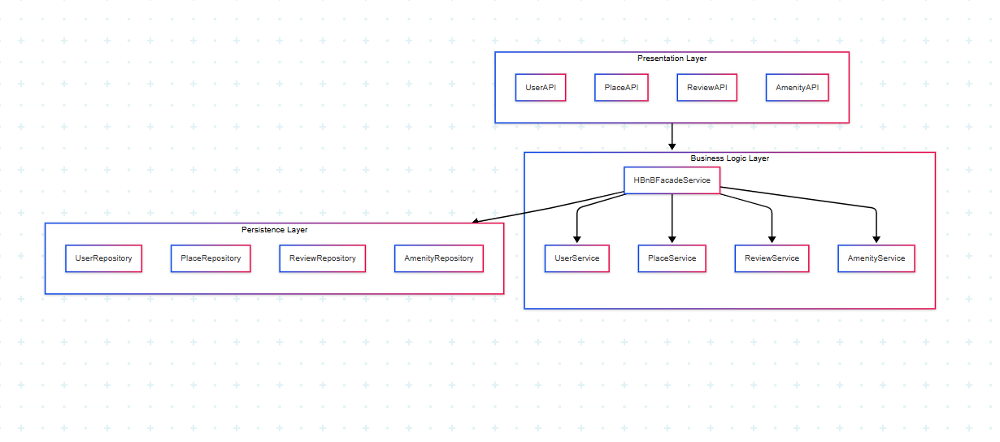

# HBnB Evolution - Technical Documentation (Part 1)

This folder contains all the technical documentation and diagrams for **Part 1** of the HBnB Evolution project.

## 📝 Introduction

This document provides comprehensive technical documentation for the HBnB Evolution application—a simplified, modular reimagining of an AirBnB-like platform. It is intended to serve as the architectural foundation for development, offering clear insight into system components, design rationale, and key interactions within the application.

HBnB Evolution enables users to interact with a digital marketplace for property rentals. The documentation outlines the structure and logic that drive core features, including user interactions, data flow, and service relationships. It is designed to support both current development efforts and future scalability or integration.

This documentation includes architectural diagrams, class structures, and interaction flows that collectively illustrate the design of HBnB Evolution. It aims to support developers, contributors, and technical stakeholders in understanding, maintaining, and extending the system efficiently.

## 🏗 High-Level Architecture:

This diagram illustrates the high-level structure of the HBnB application modules:

## 🧠 Business Logic Layer:

The class diagram describes the relationships between system components:

## 🔄 API Interaction Flow:

### 📜👤 Sequence Diagram - User Registration

This sequence diagram demonstrates the flow of a login request:

### 📜🏠 Sequence Diagram - Place Creation

This sequence diagram demonstrates the flow of a login request:

### 📜⭐ Sequence Diagram - Review Submission

This sequence diagram demonstrates the flow of a login request:

### 📜🏘️ Sequence Diagram - Fetching a List of Places

This sequence diagram demonstrates the flow of a login request:

## 📁 Contents

- `README.md` — This file. Provides an overview of the folder contents.
- `package_diagram.PNG` — High-level **Package Diagram** showing the architecture layers:
  - Presentation Layer
  - Business Logic Layer
  - Persistence Layer
  - All connected through a Facade pattern.
- `package_diagram.mmd` — Mermaid source file for the package diagram.
- `class_diagram.png` — Detailed **Class Diagram** of the Business Logic layer, showing:
  - Entities: User, Place, Review, Amenity
  - Attributes, methods, and relationships.
- `SequenceDiagrams/` — Folder containing **Sequence Diagrams** for selected API flows:
  - User Registration
  - Place Creation
  - Review Submission
  - Fetching Places

## 📌 Objective

The diagrams and notes here represent the foundational design and architecture of the HBnB system. This documentation is used to guide the implementation phase and ensure consistency across all development layers.

## 🧠 How to Use

- Use the diagrams to understand how each part of the system is structured and interacts with others.
- Refer to these visuals when implementing models, APIs, and database schemas.

## ✅ Status

✅ Completed Part 1 — Ready for development phase.

---

## ✍ Author
[Abdulaziz - "AbdulazizT-IT"](https://github.com/AbdulazizT-IT)
[Yasser - "YuriSoma"](https://github.com/YuriSoma)
[Meshari - M0simi](https://github.com/M0simi)
