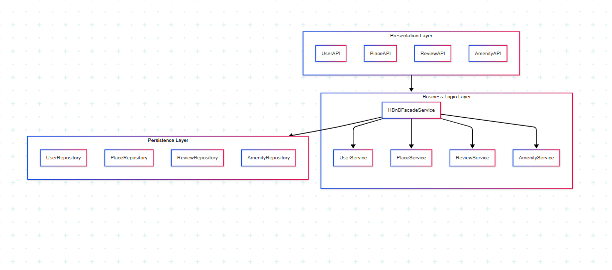
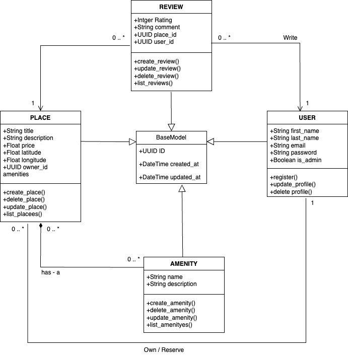
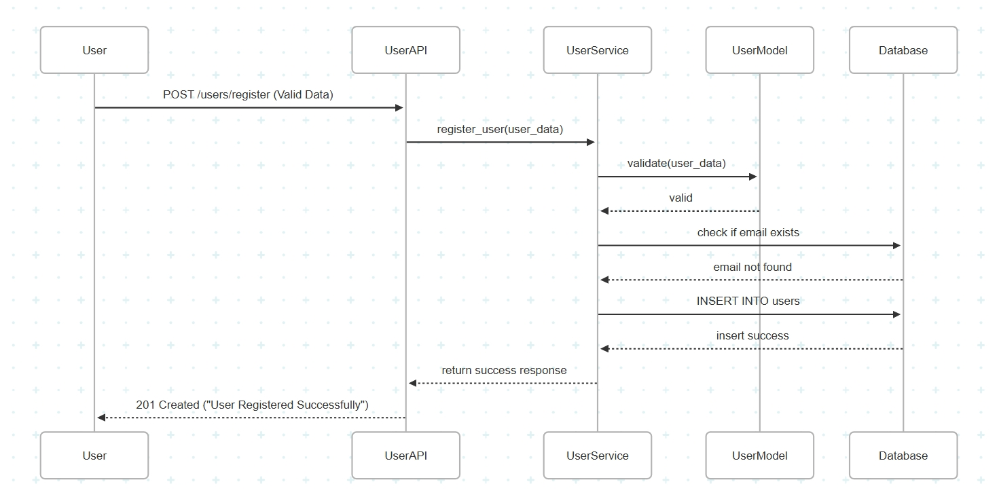
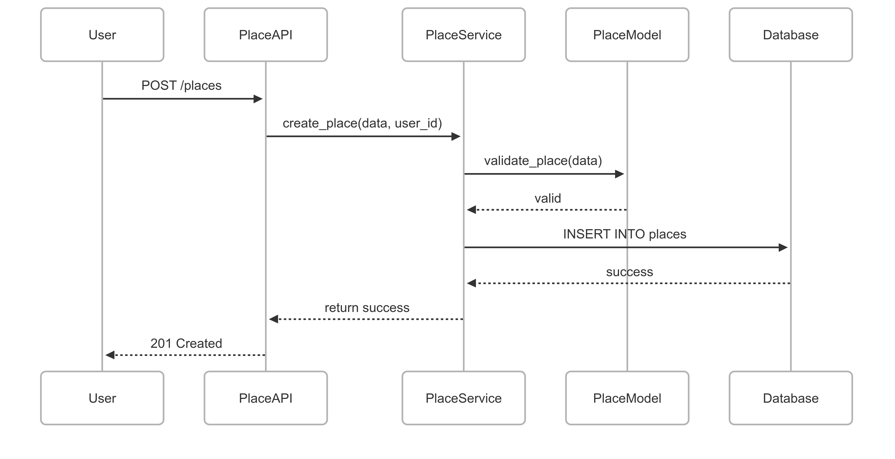
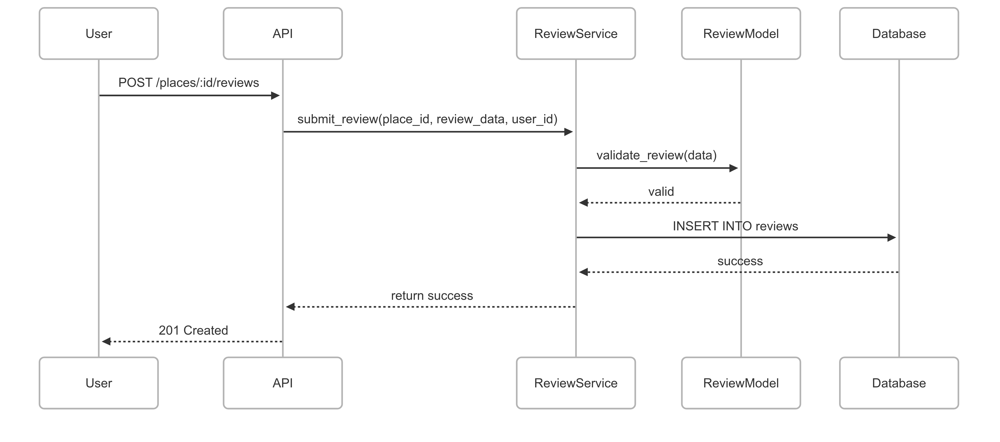
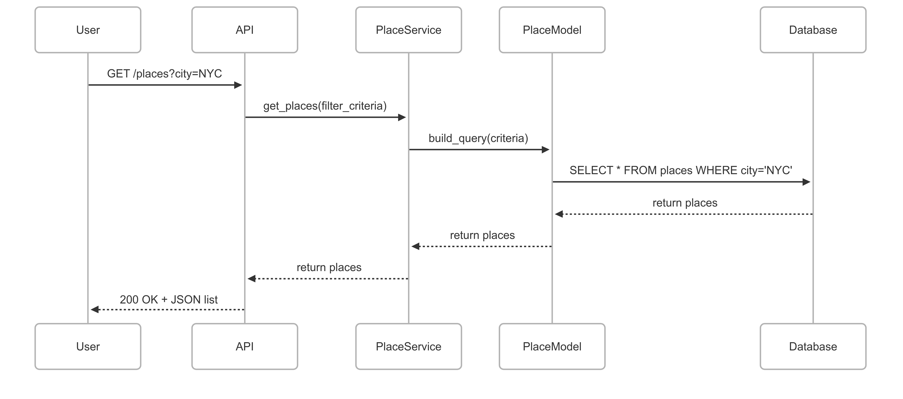

# HBnB Evolution - Technical Documentation (Part 1)

This folder contains all the technical documentation and diagrams for **Part 1** of the HBnB Evolution project.

## 📝 Introduction

This document provides comprehensive technical documentation for the HBnB Evolution application—a simplified, modular reimagining of an AirBnB-like platform. It is intended to serve as the architectural foundation for development, offering clear insight into system components, design rationale, and key interactions within the application.

HBnB Evolution enables users to interact with a digital marketplace for property rentals. The documentation outlines the structure and logic that drive core features, including user interactions, data flow, and service relationships. It is designed to support both current development efforts and future scalability or integration.

This documentation includes architectural diagrams, class structures, and interaction flows that collectively illustrate the design of HBnB Evolution. It aims to support developers, contributors, and technical stakeholders in understanding, maintaining, and extending the system efficiently.

## 🏗 High-Level Architecture:

- 📝 Explanatory Notes
  * Purpose:
    - This diagram presents the high-level modular organization of the HBnB Evolution application.
  
  * Key Components:
  
    - auth: Manages user authentication and role validation.
    
    - user: Handles user profiles, registration, and updates.
    
    - place: Contains logic for creating, updating, and displaying place listings.
    
    - review: Manages user reviews and ratings for places.
    
    - amenity: Controls the definition and association of amenities to places.
  
  * Design Decisions:
  
    - Packages are separated by domain responsibility for modularity and maintainability.
    - Each package encapsulates related classes and services to follow the Separation of Concerns principle.

  * Role in Architecture:
    - It defines the system’s modular structure and is foundational for understanding how responsibilities are distributed across the codebase.

## 🧠 Business Logic Layer:

- 📝 Explanatory Notes
  * Purpose:
    - This diagram shows the object-oriented design of the application and illustrates class relationships and responsibilities.
  
  * Key Components:
  
    - User: Base entity with fields like id, name, email, and role.
    - Place: Represents a rental listing with name, description, location, price, and associations to Amenity.
    - Amenity: Describes available features (e.g., WiFi, parking) linked to places.
    - Review: Linked to both User and Place, includes rating and comment.
  
  * Design Decisions:
  
    - Used composition (e.g., Place has Amenities) to show ownership relationships.
    - Each package encapsulates related classes and services to follow the Separation of Concerns principle.

  * Role in Architecture:
    - This forms the backbone of the domain model, defining entities that are used across API endpoints and services.

## 🔄 API Interaction Flow:

### 📜👤 User Registration Sequence Diagram

- 📝 Explanatory Notes
  * Purpose:
    - Illustrates the step-by-step interaction when a new user signs up for an account.
  
  * Key Components:
  
    - Client: Initiates the sign-up request.
    - UserController: Accepts and validates input.
    - UserService: Handles business logic such as hashing passwords and creating the user entity.
    - UserRepository: Persists the new user to the database.
  
  * Design Decisions:
  
    - Password hashing is performed at the service layer to ensure separation of concerns.
    - Immediate response includes a success message or error details, keeping the API RESTful and stateless.

  * Role in Architecture:
    - This flow establishes the entry point for new users, forming the foundation for authentication and user-specific operations later in the application

### 📜🏠 Place Creation Sequence Diagram

- 📝 Explanatory Notes
  * Purpose:
    - Shows how a user submits a request to create a new property listing.
  
  * Key Components:
  
    - Client: Sends place creation data (name, description, price, location, etc.).
    - PlaceController: Validates the request and forwards it.
    - PlaceService: Contains logic to validate ownership and format location data.
    - PlaceRepository: Persists the new place entry to the database.
  
  * Design Decisions:
  
    - Place data is validated against user ownership to prevent unauthorized access.
    - Location is stored using latitude/longitude to enable future geolocation queries.

  * Role in Architecture:
    - This flow handles core functionality for property listing, directly supporting the business model of HBnB Evolution.

### 📜⭐ Review Submission Sequence Diagram

- 📝 Explanatory Notes
  * Purpose:
    - Captures the interaction flow for submitting a review on a place.
  
  * Key Components:
  
    - Client: Submits a review containing a rating and comment.
    - ReviewController: Validates review content and user authorization.
    - ReviewService: Verifies that the user has visited the place, then creates the review.
    - ReviewRepository: Saves the review to the database.
  
  * Design Decisions:
  
    - Includes a pre-check to ensure users can only review places they have stayed at.
    - Ratings are validated for acceptable ranges (e.g., 1–5).

  * Role in Architecture:
    - This diagram highlights user feedback mechanisms, crucial for building trust and transparency within the platform.

### 📜🏘️ Fetching a List of Places Sequence Diagram

- 📝 Explanatory Notes
  * Purpose:
    - Describes how the system handles a request to retrieve a list of places based on filters (e.g., location, price, amenities).
  
  * Key Components:
  
    - Client: Sends a request with optional filters.
    - PlaceController: Parses query parameters and initiates the search.
    - PlaceService: Applies business rules and formats results.
    - PlaceRepository: Executes database queries with filter criteria.
  
  * Design Decisions:
  
    - Uses dynamic filtering to support flexible search options.
    - Pagination and sorting can be included to optimize performance and usability.

  * Role in Architecture:
    - This interaction supports discoverability and search, a key use case for end-users browsing available places.

## ✅ Status

✅ Completed Part 1 — Ready for development phase.

---

## ✍ Author
[Abdulaziz - "AbdulazizT-IT"](https://github.com/AbdulazizT-IT)
[Yasser - "YuriSoma"](https://github.com/YuriSoma)
[Meshari - M0simi](https://github.com/M0simi)
